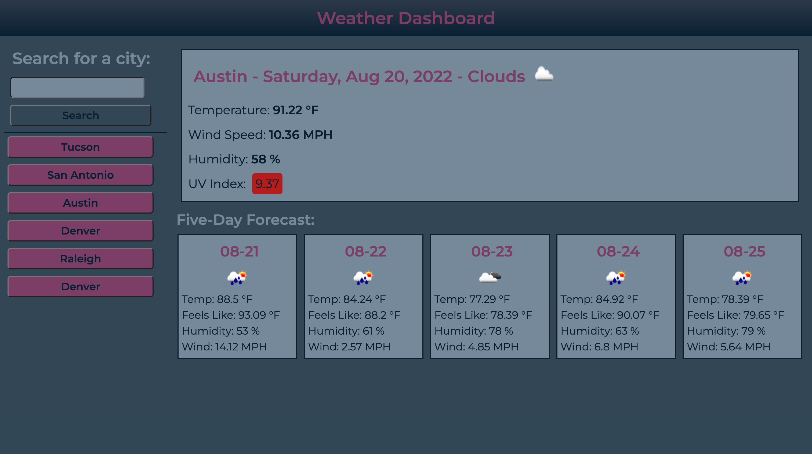

# bc-weather-app

## About

This is an app that allows a user to enter a city of her/his choice and receive current and forecast weather conditions information for that city. Current weather information provided includes temperature, wind speed, humidity, and UV index (dynamically color-coded for severity). Forecast weather information is available for 5 days and includes temperature, wind speed, humidity, and "feels like."

The app stores user search history in localStorage and renders buttons to allow easy access for old search results. Simply click on a pink search history button to view current and forecast conditions for that city.

## Screenshots

## Deployed Application Link

https://relero90.github.io/bc-weather-app/
